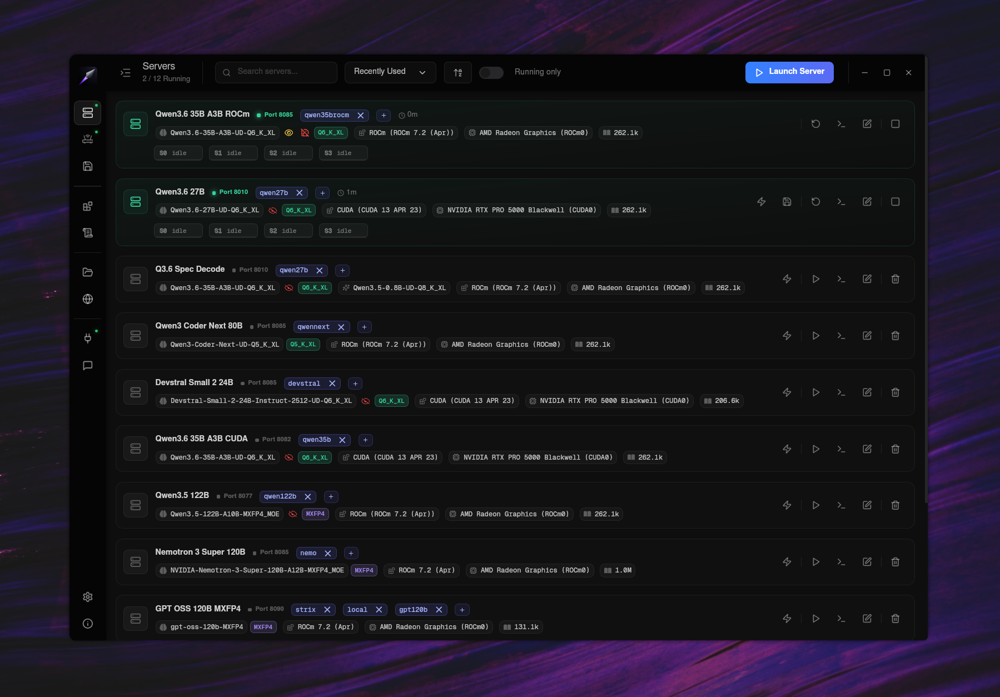
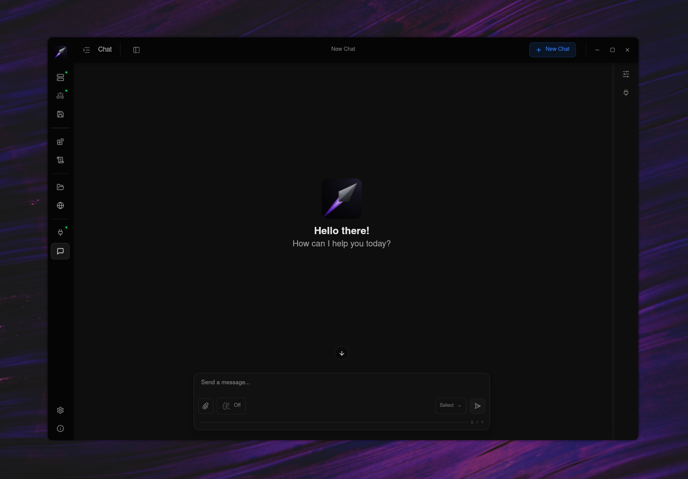
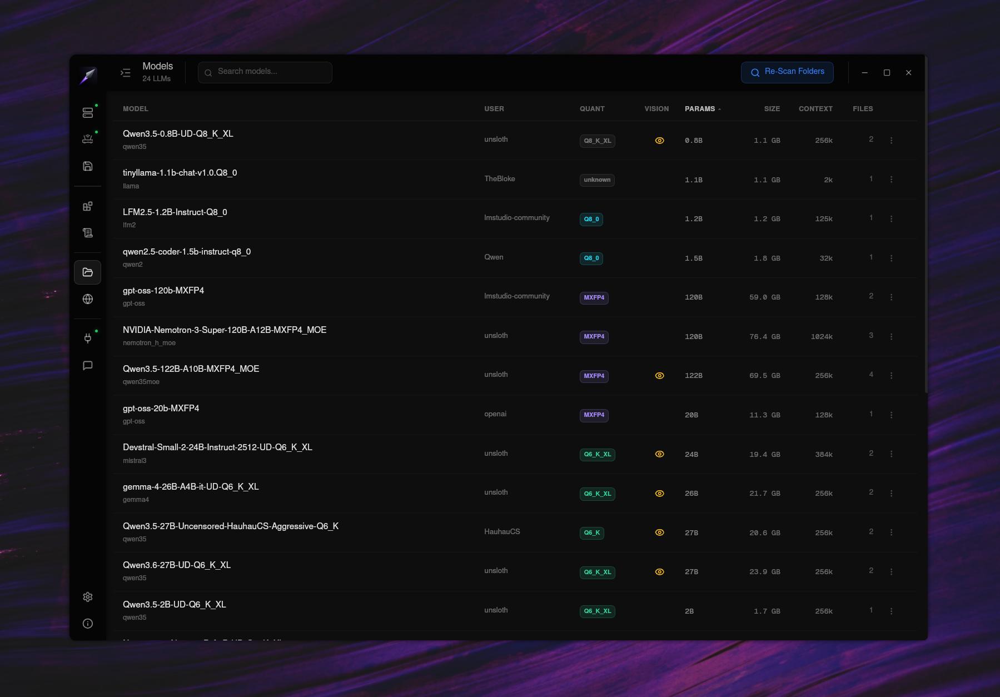
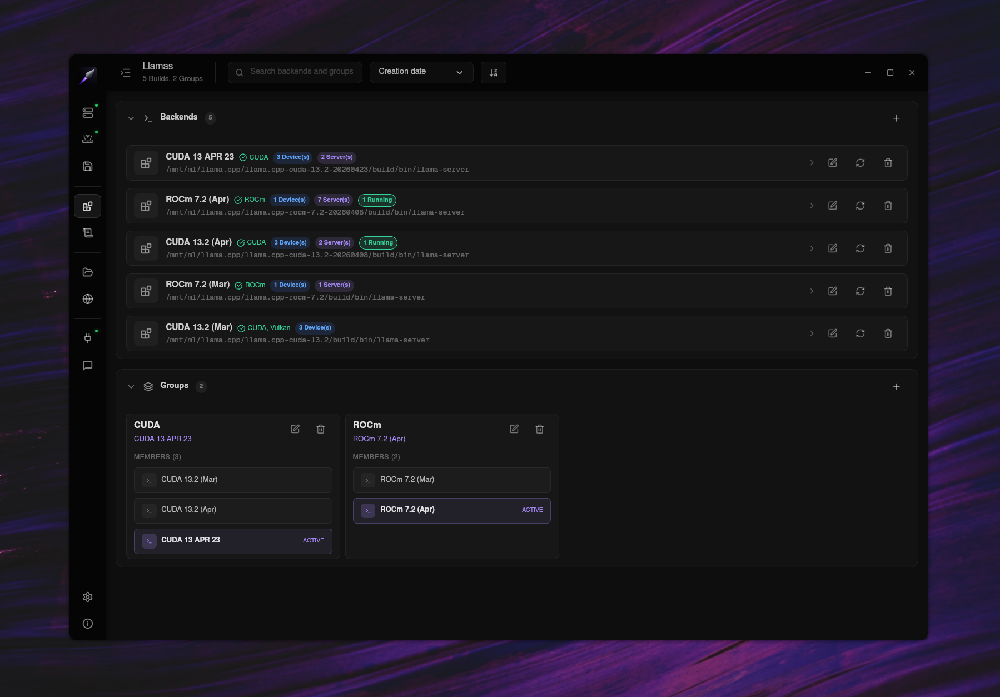
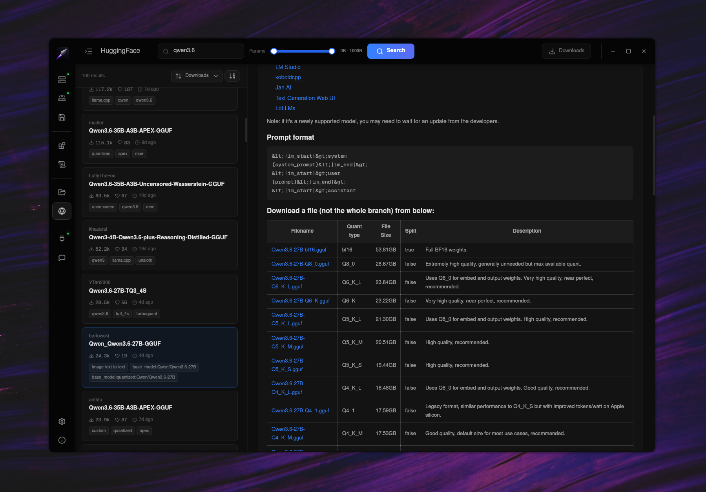
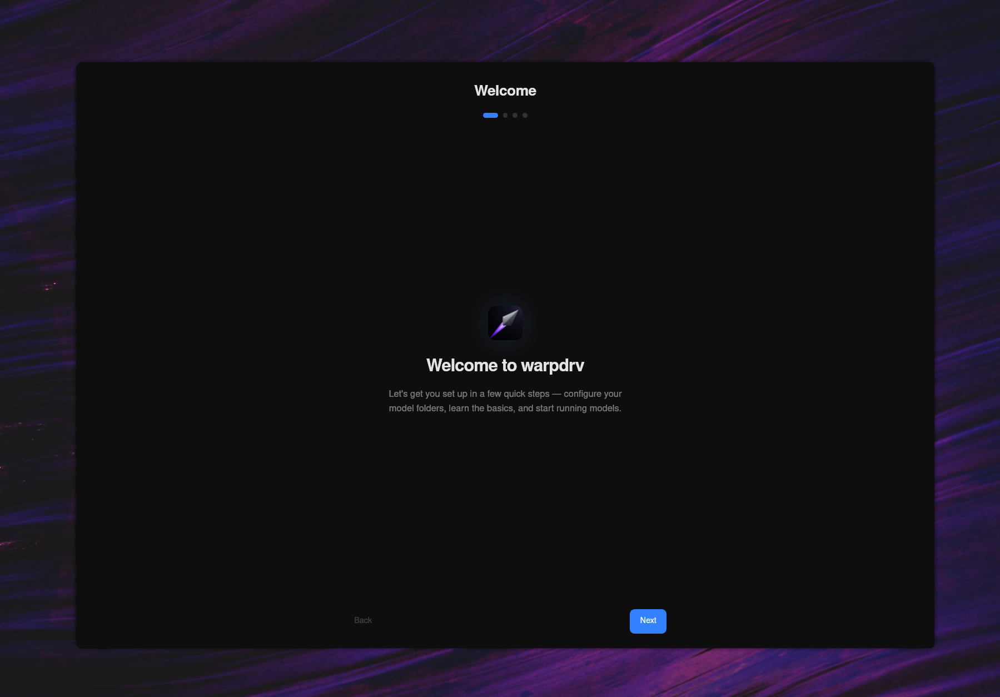
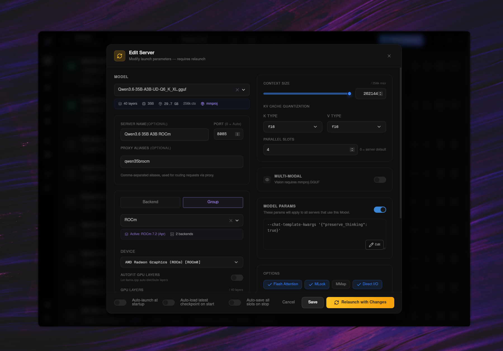
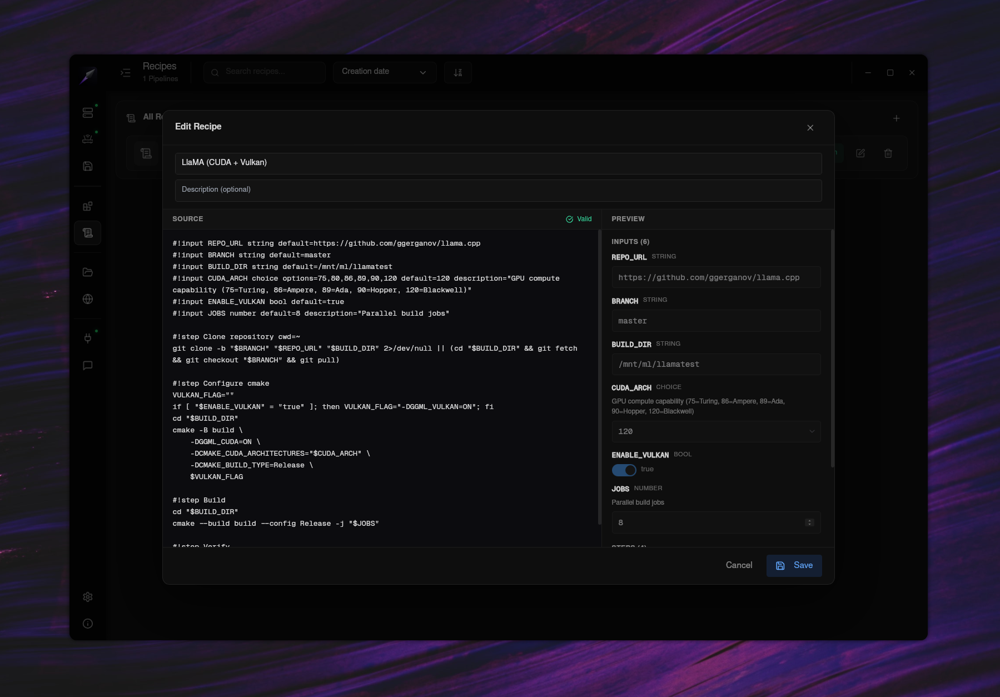
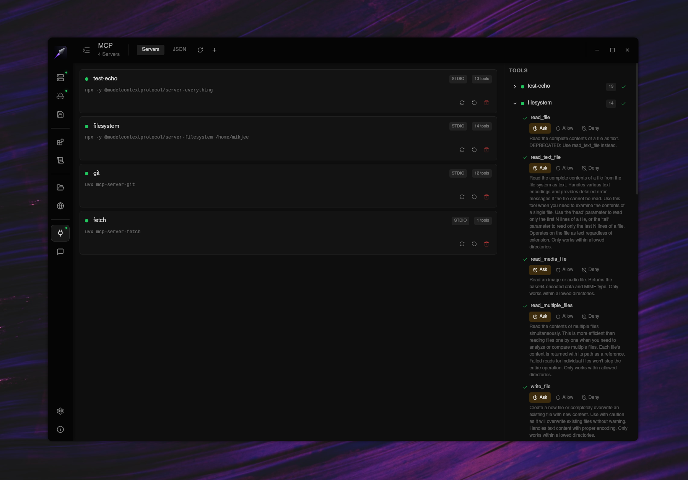

<div align="center">


# warpdrv

**LLMs + Server + Chat + More**

**100% Offline - Built for Local AI master race, oh yeah!**

[](https://www.gnu.org/licenses/agpl-3.0)
[](https://github.com/mikjee/warpdrv/releases)
[](https://github.com/mikjee/warpdrv/actions)
[](https://github.com/mikjee/warpdrv/stargazers)
[](https://github.com/mikjee/warpdrv/issues)
[](#install)
[](https://discord.gg/Q9kSKhY5)
[](https://www.reddit.com/r/warpdrv/)

<br />



</div>

---

> **Alpha release - expect things to be broken.** This project is in active development.

---

## What is warpdrv?

warpdrv is a desktop toolkit for running local language models. It manages llama.cpp server instances across multiple GPU backends, parses GGUF models, and ships a built-in chat UI with full sampling controls — all in a single Tauri desktop app.

It's a **workshop bench** for cutting-edge LLM testing: try beta models the day they release, swap between custom llama.cpp builds, run speculative decoding setups across multiple GPUs, automate build recipes. Not a polished daily-driver chat app — that's a different category.

## Why use this?

- **Try new models as soon as they are released** - bring your own llama.cpp builds; not wait for vendor's release cycle.
- **Multi-backend, multi-GPU** - CUDA, ROCm, Vulkan; mix devices in one inference session.
- **Your daily driver** - Integrates with your favorite tools with a customizable router. batteries included.
- **Workshop tools** - Speculative decoding config, MCP integration, bash-based build recipes, KV cache checkpointing.
- **Open source** - No hidden code. No analytics.

---

## Table of Contents

- [Screenshots](#screenshots)
- [Features](#features)
- [Install](#install)
- [Quick Start](#quick-start)
- [How-To Guides](#how-to-guides)
- [Hardware Compatibility](#hardware-compatibility)
- [FAQ](#faq)
- [Roadmap](#roadmap)
- [For Developers](#for-developers)
- [Contributing](#contributing)
- [Community & Support](#community--support)
- [Acknowledgements](#acknowledgements)
- [License](#license)

---

## Screenshots

<table>
<tr>
<td></td>
<td></td>
</tr>
<tr>
<td></td>
<td></td>
</tr>
</table>

<details>
<summary>More screenshots</summary>

<table>
<tr>
<td></td>
<td></td>
</tr>
<tr>
<td></td>
<td></td>
</tr>
</table>

</details>

---

## Features

**Server management.** Launch llama-server instances with full parameter control, including cache checkpointing, speculative decoding, n-gram speculation, multimodal projections, and any custom flag you need. Per-model parameter overrides let you save the right settings for each model so launch is one click.

**Proxy.** An OpenAI-compatible endpoint proxy lets any chat app talk to your running servers. Server aliases route requests to the right backend, with optional auth and a built-in web server for the UI, so you can access host and warpdrv anywhere.

**Backends.** Register one or more `llama-server` builds — stock, custom-compiled, ROCm, CUDA, whatever — and group them for quick swapping. The Recipe Engine compiles fresh builds on demand using shared bash recipes.

**Models.** Browse and download from Hugging Face Hub directly inside warpdrv, with full download management. Local models are scanned, parsed, and organised into folders.

**Chat.** A built-in chat UI with threads, folders, and full sampling configuration. MCP server integration handles tool calling with per-tool permission prompts.

---

## Install

### Linux (recommended)

Download the latest `.deb` or `.AppImage` from the [releases page](https://github.com/mikjee/warpdrv/releases).

**.deb (Debian, Ubuntu, Mint):**

```bash
sudo dpkg -i warpdrv_*.deb
```

**.AppImage (any distro):**

```bash
chmod +x warpdrv-*.AppImage
./warpdrv-*.AppImage
```

### Windows

No prebuilt installer yet. Build from source — see [For Developers](#for-developers).

### macOS

No prebuilt build yet. Build from source — see [For Developers](#for-developers). Untested on Apple Silicon; PRs welcome.

### First Run

On first launch, warpdrv shows an **onboarding welcome screen** that walks you through:

1. Adding a folder where your GGUF models live (or where to download them)
2. Optional: registering a llama.cpp build
3. A short slideshow of next steps (launch a server, start chatting, etc.)

Config and data are stored at `~/.config/warpcore/`. Survives upgrades — config is preserved across reinstalls.

### Updating

warpdrv checks for updates on startup and shows a banner if a new version is available. Click the banner to open the releases page, download the new version, install it. Your data is preserved.

---

## Quick Start

1. **Install warpdrv** — see [Install](#install)
2. **Onboarding** — pick a models folder, optionally add a llama.cpp build
3. **Scan models** — warpdrv parses every GGUF in your folder
4. **Add a backend** — point warpdrv at a `llama-server` binary; it auto-detects devices
5. **Launch a server** — pick a model, set GPU layers + context, hit Launch
6. **Open Chat** — pick the running server, start a thread, test the model

---

## How-To Guides

- **Adding a custom llama.cpp build** — TODO
- **Setting up speculative decoding** — TODO
- **Configuring MCP servers** — TODO
- **Writing a build recipe** — TODO
- **Multi-GPU setup (CUDA + Vulkan)** — TODO
- **Using warpdrv as a server-only backend for other chat UIs** — TODO
- **Accessing warpdrv UI remotely**

---

## Hardware Compatibility

### Tested Configurations

warpdrv works with any standard `llama-server` binary, so compatibility tracks llama.cpp's own support matrix.

### Backends

| Backend | Status |
|---------|--------|
| CUDA (NVIDIA) | Supported |
| ROCm (AMD) | Supported |
| Vulkan (any GPU) | Supported |
| CPU only | Supported |

### Notes

- Bring your own `llama-server` binary built against your hardware. The Recipe Engine can help compile one.
- Speculative decoding may not work with sliding-window-attention models.
- For GPU-specific build flags and runtime quirks, see the llama.cpp documentation for your target.

---

## FAQ

<!-- TODO local AI: tighten any answers, add more if obvious gaps -->

**Is this a daily-driver chat app?**
Depends. warpdrv is a workshop bench for testing models and llama.cpp builds. For polished daily chat, or coding, warpdrv's proxy server integrates seamless with your existing tools and workflows, and provides a customizable router using user-defined aliases.

**How does this differ from LM Studio / Ollama / Jan?**
Many server management apps bundle a fixed llama.cpp version and limits which models / quants work. warpdrv lets you bring your own llama.cpp builds — including bleeding-edge forks — and run them with full parameter control. Built for tinkerers, and also for end-users wanting a one-click chat app.

**Do I need to compile llama.cpp myself?**
No, but you can. warpdrv works with any standard `llama-server` binary. The Recipe Engine helps if you want to compile your own. Note: warpdrv does *not* ship with a llama binary, you have download one from the official github repo [LlaMa.cpp Releases](https://github.com/ggml-org/llama.cpp/releases).

**Where is my data stored?**
Linux: `~/.config/warpcore/` — chat database, settings, MCP config, recipes. Models stay wherever you put them; warpdrv only indexes them.

**Can I use warpdrv commercially?**
warpdrv is licensed under AGPL-3.0. If you offer it as a network service, you must publish your modifications under AGPL. For commercial licensing without AGPL obligations, join the Discord and PM the mods.

**Why AGPL?**
To keep the project genuinely open: derivatives stay open, including SaaS forks.

**Does warpdrv send my data anywhere?**
No telemetry, no analytics, no remote calls — except the version-check ping to fetch `release.json` from the GitHub repo on startup.

**Why is X feature broken?**
Alpha software. File an issue with reproduction steps. Better yet, send a PR :)

---

## Roadmap

- **Short-term**
  - Stabilise critical features (server stop, log parsing)
  - Windows prebuilt installer
- **Mid-term**
  - macOS prebuilt build (Apple Silicon)
  - Voice dictation in chat
- **Long-term**
  - Richer chat interface.

User feedback and feature requests are very welcome — drop them in [Discord](https://discord.gg/Q9kSKhY5), [Reddit](https://www.reddit.com/r/warpdrv/), or [GitHub Issues](https://github.com/mikjee/warpdrv/issues).

---

## For Developers

### Architecture

warpdrv is a Tauri desktop app wrapping a Node.js server and a React frontend. The Tauri shell spawns the Node server as a sidecar binary on launch, monitors its health, and restarts it on crash. The React app talks to the server over HTTP + SSE.

### Tech Stack

- **Desktop shell** — Tauri 2 (Rust)
- **Frontend** — React 19, Chakra UI v3, Vite, Zustand, assistant-ui
- **Server** — Node 24, Express 5, better-sqlite3, better-sse
- **Bundling** — esbuild + `@yao-pkg/pkg` (server binary), Vite (frontend)
- **Shared types** — TypeScript-only `@warpcore/shared` package

### Monorepo Structure

```
packages/
  shared/   @warpcore/shared   — Types, enums, utilities. No runtime deps.
  app/      @warpcore/app      — React frontend.
  server/   @warpcore/server   — Express + SQLite. Process management, GGUF parsing, recipes.
  bridge/   @warpcore/bridge   — Composable chat engine (extracted, used internally).
  desktop/                     — Tauri shell + release scripts.
```

### Build From Source

**Prerequisites:**

- Node 24+
- Rust + Cargo (for Tauri)
- Linux: standard Tauri dependencies — see [Tauri prerequisites](https://tauri.app/start/prerequisites/)

**Steps:**

```bash
git clone https://github.com/mikjee/warpdrv.git
cd warpdrv
npm install
```

**Run in dev mode:**

The recommended way is via VSCode. Open the repo, go to the **Run and Debug** panel, pick the `warpdrv-all` launch config, and hit play. All packages launch in a single integrated terminal.

If you don't use VSCode, run the same thing manually:

```bash
npm run dev
```

**Release build:**

```bash
./release.sh                    # Linux .deb (default)
./release.sh deb appimage       # both .deb and .AppImage
./release.sh appimage           # AppImage only
```

Bundle formats supported by Tauri: `deb`, `appimage`, `rpm`, `dmg`, `msi`, `nsis`, `updater`. Pass any combination to `release.sh`.

Artifacts land in `packages/desktop/target/release/bundle/`.

---

## Contributing

Contributions are welcome. See [CONTRIBUTING.md](CONTRIBUTING.md) for setup, conventions, and PR rules.

- Look for [`good first issue`](https://github.com/mikjee/warpdrv/issues?q=label%3A%22good+first+issue%22) labels
- All commits must be signed off (`git commit -s`) per the [Developer Certificate of Origin](https://developercertificate.org/)
- Follow the codebase conventions: hard tab indent, `T`/`I`/`E` type prefixes, `Record<>` over `Map`, no `any`

---

## Community & Support

- **Discord** — [discord.gg/Q9kSKhY5](https://discord.gg/Q9kSKhY5) (newly created, help shape it)
- **Reddit** — [r/warpdrv](https://www.reddit.com/r/warpdrv/)
- **Issues** — [GitHub Issues](https://github.com/mikjee/warpdrv/issues)
- **Discussions** — [GitHub Discussions](https://github.com/mikjee/warpdrv/discussions)

---

## Acknowledgements

warpdrv stands on the shoulders of:

- [llama.cpp](https://github.com/ggml-org/llama.cpp) — Georgi Gerganov and contributors
- [Tauri](https://tauri.app/) — desktop shell framework
- [assistant-ui](https://github.com/Yonom/assistant-ui) — chat UI primitives
- [better-sqlite3](https://github.com/WiseLibs/better-sqlite3), [better-sse](https://github.com/MatthewWid/better-sse), [Express](https://expressjs.com/), [React](https://react.dev/), [Chakra UI](https://chakra-ui.com/), [Vite](https://vitejs.dev/), [Zustand](https://zustand-demo.pmnd.rs/)
- All beta testers and early users

---

## License

warpdrv is licensed under the **GNU Affero General Public License v3.0** — see [LICENSE](LICENSE).

In plain English:

- Free for personal, hobbyist, and internal commercial use
- Modifications must be shared under AGPL if you distribute or run as a network service
- Original copyright notices must be preserved
- No royalties owed; no warranty provided

For commercial licensing without AGPL obligations, join the [Discord](https://discord.gg/Q9kSKhY5) and PM the mods.
